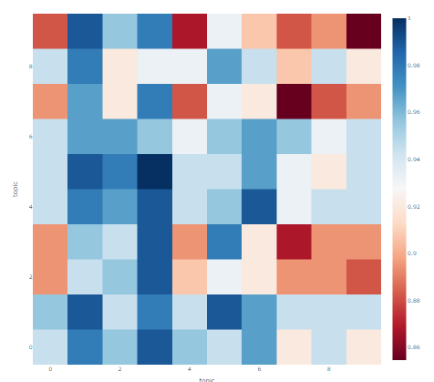
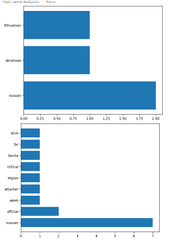

# Spectator Sport 

## Using NLP to analyse reporting done by media outlets on Russian Invasion of Ukraine 

Media plays an important role in society as it acts as a stream of communication between the public and the governments and helps in shaping opinions in both directions ie. shaping public opinion on the one hand and reporting on public consensus in order for legislators to shape public policy. 
However, in the current socio-economic climate, there is a growing distrust in the media as well as the governing bodies from the general public. This can mainly be attributed to the media being a for-profit business and the fact that major media outlets are now under people with an agenda. 

The current model of operation for media houses is extremely destructive for the society in our opinion as the monetization is based on ads that depend on clicks which in turn motivates the organizations to focus on evaluating news stories on the basis of the number of clicks a story gets as opposed to what is actually important for society as a whole to be aware of. 

This fracturing of news and the public has gotten to a point where each news outlet has it's own demographic and each can be categorized as leaning to one side of the political aisle and there is a stark distrust in the news leaning the other direction. 

This forms the motivation of our project, __determining bias in news and if there is a way to segment news outlets based on the form of reporting done by leveraging NLP methods__. 

We pick the Russian Invasion of Ukraine as a subject matter as wartime data is extremely dense and compact in terms of content by design and try to compare reporting by different media outlets. 

--------

## Requirements 

`pip install selenium webdriver_manager pandas`

--------

## Data Collection 

### Dataset 1 : __Reference__
Data was sourced from liveuamap which is a cooroborator of on-ground communications sourced from twitter, telegram and other forms of communications. 
The original dataset consists of __references__ scraped on a daily basis for a period of 2 months and can be found in the file : [raw/](./data/raw)
- Each file name acts as a timestamp 
- Each row represents a reference and contains : geotag, title, date-time data
Data was collected autonomously using a selenium based web-scraper. 

## Dataset 2 : __Article__
A second dataset was made by searching for articles made based on previously collected references to find reporting by different news sources. 
This method was done using selenium and parametrized google search. 
- For each reference there exist some articles that are collected based around this reference. 
- The article dataset can be found in the file : [author-parse-articles.csv](./data/processed/author-parse-articles.csv)

--------

> Colab Notebooks for both contain last run code outputs. 

## Method 1 `+running instructions`
### What is a story an organization is interested in publishing
[Google Colab](https://colab.research.google.com/drive/1wyZBSNKz_5n1pS3lnufwi87idoRX56VB?usp=sharing) `restart colab runtime after Env Setup Cell (known issue with google colab)`  
[Local Notebook](./notebooks/method_1.ipynb)  

__Pipeline for Method 1__
1. Filter articles by news sources 
2. Pick 2 news sources 
3. Use LDA to find important topics in the full corpus of all the articles for the two domains 
4. Compare the two LDA models using Jaccard Distance
5. Make correlations based on the jaccard matrix. 

--------

## Method 2  `+running instructions`
### What is a story an organization is interested in publishing
[Google Colab](https://colab.research.google.com/drive/1-mBDkKvSh2hWAfc6c2rGtkgyinJ994wk?usp=sharing) `restart colab runtime after Env Setup Cell (known issue with google colab)`  
[Local Notebook](./notebooks/method_2.ipynb)

__Pipeline for Method 2__
1. Filter articles by news sources.
2. Pick 2 news articles based on the same reference.
3. Train LDA Models using all articles corpus. 
3. Use LDA to find dominant topics in the full corpus of all the articles for the same reference.
4. Create bigram model and ensure one of the words is keywords provided by LDA model.
5. Compare the non-keywords frequency to make conclusion.

-------

## Insights / Results 

### Method 1 
 
For method 1 we can see 2 media companies compared in terms of their topics, the amount of red indicates common reporting topics. 
We believe that news companies which align themself similarly politically should have more red portion than blue. 

### Method 2 
 
For method 2 we can see that 2 articles from different news sources report similar keywords in the following context. 
Technically, the bigram most common with `force` in terms of frequency are listed for 2 different media outlets. 

Chao   
George  
Samarth  

